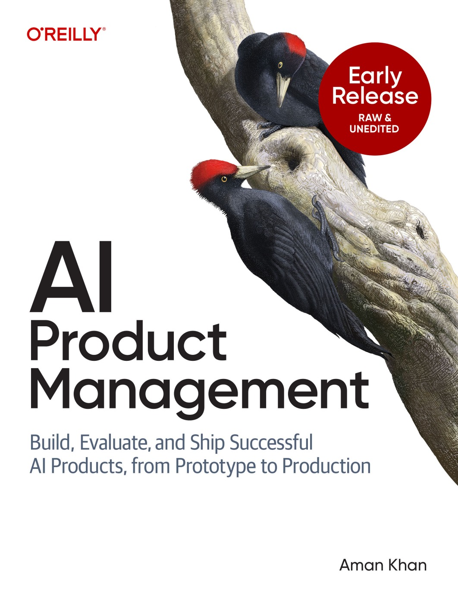

# Hi, I'm Aman 👋

I'm Head of Product at [Arize AI](https://arize.com), where I help teams build and evaluate AI products. Previously, I built products at Spotify, Cruise, Zipline, and Apple. More at [amank.ai](https://amank.ai).

## What I'm working on

I'm writing [AI Product Management](https://learning.oreilly.com/library/view/ai-product-management/0642572251048/) (O'Reilly, Early Release), covering how to build, evaluate, and ship successful AI products from prototype to production. I also teach courses on AI product management and write about what I learn at **[AI Product Playbook](https://amankhan1.substack.com)**.

Featured in **Lenny's Newsletter**:
- [Beyond Vibe Checks: A PM's Complete Guide to Evals](https://www.lennysnewsletter.com/p/beyond-vibe-checks-a-pms-complete)
- [How to Build AI Product Sense](https://www.lennysnewsletter.com/p/how-to-build-ai-product-sense)

**Courses:**
- [Claude Code for Product Managers](https://maven.com/aman-khan/claude-code-for-product-managers) · Maven (w/ Eric Xiao) · ⭐ 5.0/5
- [Build AI Product Sense](https://maven.com/aman-khan/build-ai-product-sense) · Maven (w/ Tal Raviv) · ⭐ 4.8/5
- [Prototype to Production: The AI PM Playbook](https://maven.com/aman-khan/thriving-as-an-ai-pm) · Maven · ⭐ 4.8/5
- [Evaluating AI Agents](https://learn.deeplearning.ai/courses/evaluating-ai-agents/) · DeepLearning.AI (w/ Andrew Ng and John Gilhuly)

## 💻 Open Source

- **[personal-os](https://github.com/amanaiproduct/personal-os)** ⭐ 367 · A framework for building your own AI-powered personal operating system
- **[openclaw-setup](https://github.com/amanaiproduct/openclaw-setup)** ⭐ 38 · Quick setup guide for OpenClaw

## ✍️ Writing (AI Product Playbook)

| Date | Post |
| --- | --- |
| Feb 2026 | [**How to Make Your OpenClaw Agent Useful and Secure**](https://amankhan1.substack.com/p/how-to-make-your-openclaw-agent-useful) |
| Feb 2026 | [**How Carl Set Up His Personal OS in Claude Code**](https://amankhan1.substack.com/p/how-carl-set-up-his-personal-os-in) |
| Jan 2026 | [**How to Get Clawdbot Set Up in an Afternoon**](https://amankhan1.substack.com/p/how-to-get-clawdbotmoltbotopenclaw) |
| Jan 2026 | [**Cursor for Product Managers**](https://amankhan1.substack.com/p/cursor-for-product-managers) (w/ Eric Xiao) |
| Nov 2025 | [**Building AI Product Sense with a Personal OS**](https://amankhan1.substack.com/p/building-ai-product-sense-with-a) |
| Aug 2025 | [**Beginner's Guide to AI Evals (Walkthrough)**](https://amankhan1.substack.com/p/beginners-guide-to-ai-evals-walkthrough) |
| Jul 2025 | [**How AI Prototyping Tools Actually Work: A Deep Dive into Bolt's Architecture**](https://amankhan1.substack.com/p/how-ai-prototyping-tools-actually) |
| Jun 2025 | [**How AI PMs and AI Engineers Collaborate on Evals**](https://amankhan1.substack.com/p/how-ai-pms-and-ai-engineers-collaborate) |
| Jun 2025 | [**The Five Skills I Actually Use Every Day as an AI PM**](https://amankhan1.substack.com/p/the-five-skills-i-actually-use-every) |
| Apr 2025 | [**Beyond Vibe Checks: A PM's Complete Guide to Evals**](https://amankhan1.substack.com/p/beyond-vibe-checks-a-pms-complete) |

➡️ [**See all posts on AI Product Playbook**](https://amankhan1.substack.com/archive)

## 🎙️ Talks & Podcasts

| Date | Talk |
| --- | --- |
| Sep 2025 | [**How to Thrive as an AI PM**](https://www.mindtheproduct.com/how-to-thrive-as-an-ai-product-manager-aman-khan-director-of-product-arize-ai/) · #mtpcon London |
| Aug 2025 | [**How PM Can Get the Most Out of Cursor**](https://www.youtube.com/watch?v=NXTnmfG4h7U) · ProductCon AI |
| Aug 2025 | [**Why Every AI PM Needs to Run Evals**](https://www.youtube.com/watch?v=x08tCMpLcVA) · Future Proof |
| Jun 2025 | [**Product Growth Podcast**](https://www.news.aakashg.com/p/aman-khan-podcast) · Aakash Gupta |
| Jun 2025 | [**How PMs Can Bring Predictability to AI Products**](https://www.youtube.com/watch?v=ACrOVlbk190) · Supra Insider |
| Jun 2025 | [**How Arize Found Product-Market Fit**](https://www.youtube.com/watch?v=tBwplJSXyEU) · Product Unplugged |
| Apr 2025 | [**Evaluating AI, Designing for Non-Determinism**](https://www.youtube.com/watch?v=v0eTTn7ZPEc) · Learning from Machine Learning |
| Feb 2025 | [**DeepLearning.AI Course Launch**](https://www.youtube.com/watch?v=GzxdGpFhn04) |
| Jan 2025 | [**The AI Skill That Will Define Your PM Career in 2025**](https://www.youtube.com/watch?v=u8lEDw7pOkE) · Peter Yang |
| Nov 2024 | [**Becoming an AI PM**](https://www.youtube.com/watch?v=E_rNotqs--I) · Lenny's Podcast |
| 2025 | [**Evals Course Interview**](https://www.youtube.com/watch?v=XueTa4qrMpg) · Hamel Husain |
